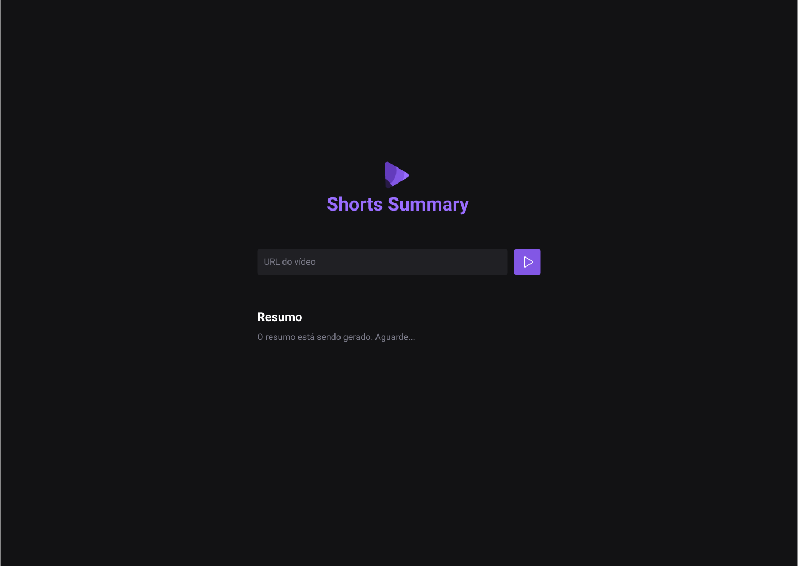

<h1 align="center">🚀 NLW IA: Shorts Summary 🚀</h1>

  

<h2>
This was a project built during Rockeseat`s Next Level Week and designed to use Artificial Intelligence to summarize a short video from Youtube.
</h2>

## 💻 Project

This project has a simple interface where the user inputs the URL of a shorts video from Youtube and then the audio of the video is downloaded, sent to an AI model to transcribe it and finally summarize the content of the video.

## 🚀 Technologies

This project was developed using the following technologies:

- HTML e CSS
- JavaScript
- Node.js
- Git e Github

## 🕹 How to use it
1.  Download the zip file.
2.  Download the modules needed with <code>npm install</code>.
3.  Open  the terminal and start the server with <code>npm run server</code>.
4. Open a new terminal and type <code>npm run web</code> to start the front end and open it on localhost.

## 🖼 Layout

You can check the project layout through [THIS LINK](<https://www.figma.com/file/JGV1SHw6jkRjrdqGnxnvlZ/Shorts-Summary-%E2%80%A2-Trilha-Foundations-(Community)-(Copy)?node-id=801%3A86&mode=dev>). It is necessary to have a [Figma](https://figma.com) account to access it.
